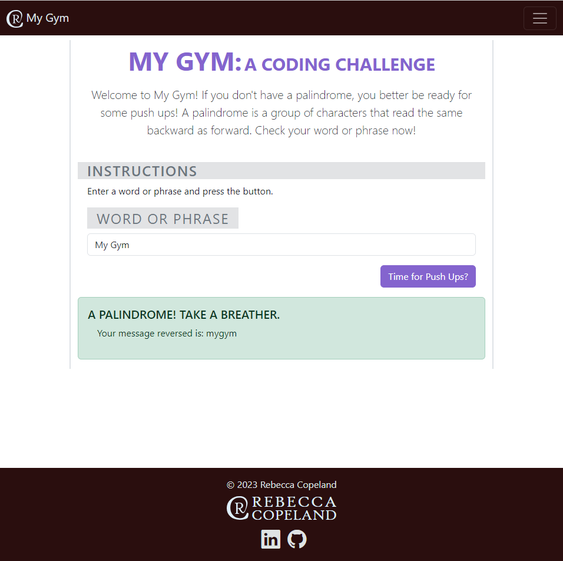
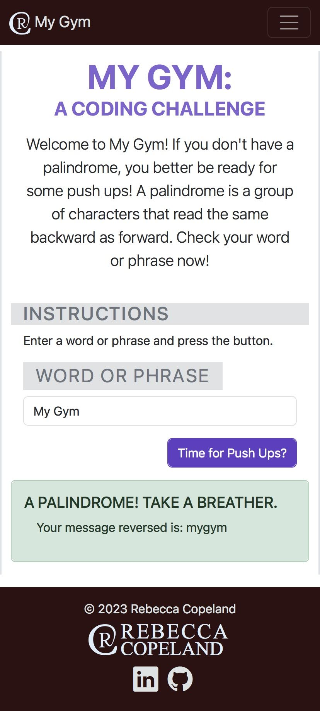

# MyGym - A Coding Challenge
Checkout this Palindrome Checker!
Welcome to My Gym! If you don't have a palindrome, you better be ready for some push ups! A palindrome is a group of characters that read the same backward as forward. Check your word or phrase now!

## Table of contents

- [Overview](#overview)
  - [Screenshot](#screenshot)
  - [Links](#links)
- [My process](#my-process)
  - [Built with](#built-with)
  - [What I learned](#what-i-learned)
  - [Possible Improvements](#possible-improvements)
  - [Useful resources](#useful-resources)
- [Author](#author)

## Overview

### Screenshot

Desktop Web App Screenshot:


Mobile Web App Screenshot:
<br/>


### Links

- Live Site URL: [Netlify](https://courageous-kheer-dbb7e6.netlify.app/)
- Repo URL: [Github Repo](https://github.com/rebcop/MyGym)

## My process

### Built with

- CSS and Bootstrap Layout
- JavaScript Fundamentals
- JavaScript Loops
- JavaScript DOM Manipulation
- Boolean Logic
- TECH STACK: JavaScript, HTML, CSS, Bootstrap

### What I learned

1. Regex can be used to easily filter messages to keep only valid characters.

    Regex with RegExp Method of test()
    ```js
    let regex = /[A-Za-z0-9]/;
    for (let i = 0; i < message.length; i++) {

        if (regex.test(message[i])) {
            msgClean += message[i].toLowerCase();
        }
    }
    ```
  
   Regex with String Method of replace() that outputs the same as above
    ```js
    let regex = /[^A-Za-z0-9]/;
    msgClean = message.replace(regex,'').toLowerCase();
    ```

2. There can be multiple returns in a function to return different values depending on certain conditions.
    ```js
    function checkForPalindrome(message) {
    ...
      let output = [];
      if ( msgClean == '' ) {
          output.push('error');
          return output;
  
      } else if ( msgClean == msgCleanRev ) {
          output.push(true);
          output.push(msgCleanRev);
          return output;
      }
      
      else {
          output.push(false);
          output.push(msgCleanRev);
          output.push(msgClean.length*5 % 100 + 20);
          return output;
      }
    ...
    }
    ```

  3. Use objects to return multiple values from a function instead of an array so that the values can be accessed by name instead of index.
     Accessing by name allows the code to be more easily read.

      ```js
      function checkForPalindrome(message) {
      ...
        let output = {
              isPalindrome:'',
              revMsg: '',
              numPushUps:'',
            };
        if ( msgClean == '' ) {
            output.isPalindrome = 'error';
            return output;
    
        } else if ( msgClean == msgCleanRev ) {
            output.isPalindrome = true;
            output.revMsg = msgCleanRev;
            return output;
        }
        
        else {
            output.isPalindrome = false;
            output.revMsg = msgCleanRev;
            output.numPushUps = msgClean.length*5 % 100 + 20;
            return output;
        }
      ...
      }
      ```
### Possible Improvements
1. Combine the two for loops in the checkForPalindrome function.

2. In displayResults use an object to return the results instead of an array for readability.


### Useful resources

- [W3 Schools](https://www.w3schools.com/js/js_regexp.asp)
- [MDN Web Docs](https://developer.mozilla.org/en-US/docs/Web/JavaScript/Guide/Regular_expressions)

## Author

- Check out my portfolio - [Rebecca Copeland](https://rebcop.dev/)
- Message Me - [LinkedIn](https://www.linkedin.com/in/rebcop/)
